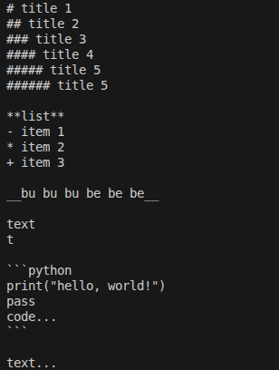
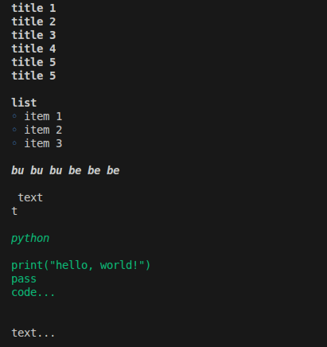

# markdown_read
простая консольная программа для удобного просмотра md файлов с markdown разметкой

программа не потдержиывает всех возможностей MarkDown но делает чтение в консоли более приятным 

**пример работы:**

ихдоный текст с разметкой:

текст отоброженный с помщю этой программы:

