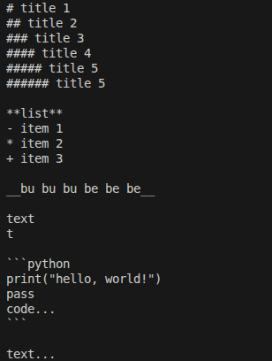
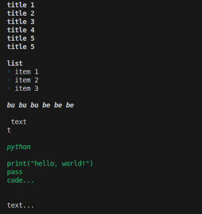

# markdown_read
простая консольная программа для удобного просмотра `md` файлов с markdown разметкой

программа не поддерживает всех возможностей MarkDown но делает чтение в консоли более приятным 

**что поддерживается:**
`#` - заголовки любого уровня

` ` - перенос строки

`>` - цитаты с вложенностью

`** * ~~ __` - стили текста: жирный, курсив, зачеркнутый, выделенный

`* - +` - списки

`\`\`\`` - выделенный код

`\`\`` -  выделенная команда

**пример работы:**

ихдоный текст с разметкой:

текст отображенный с помощью этой программы:

